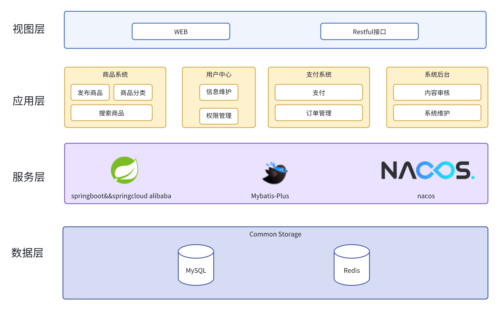

# dataMall【数据交易平台后端】

csdn博客链接:https://blog.csdn.net/wooovi

欢迎各位佬指正

dataMall前端：https://github.com/mrwoov/dataMallUi

# 项目说明

datamall是一个基于区块链技术的数据交易与鉴权平台

# 系统架构图

# 技术选型

| 技术         | 说明        | 官网                                     |
|------------|-----------|----------------------------------------|
| springboot | Web应用开发框架 | https://spring.io/projects/spring-boot |
